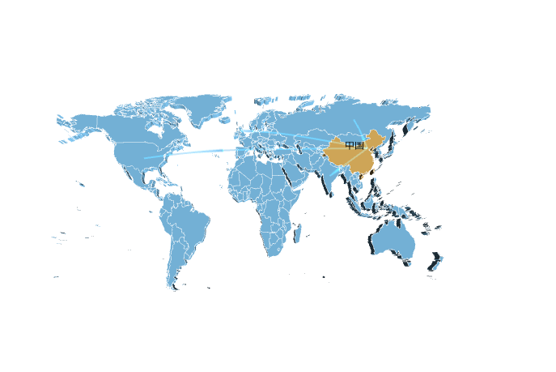

# 3D 地球和世界地图

## 安装 echarts

```sh
npm i echarts echarts-gl
```

## 下载依赖

1. 地图数据 [地址](https://gitcode.com/weixin_46011719/echarts/tree/master)
   下载完成以后需要对其进行改变一下，原本是他是放在一个匿名自执行函数里面，直接在 vue 里面引用会报错，要把他变成 export 对象，代码片段实例

```js
export default {
  type: 'FeatureCollection',
  crs: {
    type: 'name',
    properties: {
      name: 'urn:ogc:def:crs:OGC:1.3:CRS84'
    }
  },
  features: [
    {
      geometry: {
        type: 'Polygon',
        coordinates: [
          [
            [47.97822265625001, 7.9970703125],
            [46.97822265625001, 7.9970703125],
            [43.98378906250002, 9.008837890624989],
            [43.482519531250006, 9.379492187499991],
            [43.181640625, 9.879980468749991],
            [42.84160156250002, 10.203076171874997],
            [42.65644531250001, 10.6],
            [42.92275390625002, 10.999316406249989],
            [43.24599609375002, 11.499804687499989],
            [43.85273437500001, 10.784277343749991],
            [44.38652343750002, 10.430224609374989],
            [44.94296875, 10.43671875],
            [45.81669921875002, 10.835888671874997],
            [46.565039062500006, 10.745996093749994],
            [47.40498046875001, 11.174023437499997],
            ...............
```

2. 城市坐标数据用于绘制飞线 [地址](https://juejin.cn/post/6844903890614222855)

```js
export default {
  阿克苏地区: [80.260604, 41.168779],
  和田地区: [79.922211, 37.114157],
  上海: [121.480237, 31.236305],
  东莞: [113.758231, 23.026997],
  东营: [118.588614, 37.454925],
  中山: [113.399023, 22.522262],
  临汾: [111.526153, 36.094052],
  临沂: [118.36299, 35.110531],
  丹东: [124.362564, 40.00569],
  丽水: [119.929503, 28.472979],
  乌鲁木齐: [87.623314, 43.832806],
  佛山: [113.128432, 23.027707],
  保定: [115.471052, 38.880055],
  兰州: [103.840692, 36.067312],
  包头: [109.846755, 40.663636],
  北京: [116.41, 39.91],
  北海: [109.126614, 21.486955],
  南京: [118.802891, 32.064735],
  南宁: [108.373351, 22.823037],
  南昌: [115.864528, 28.687675],
  南通: [120.900301, 31.985237],
  厦门: [118.095915, 24.485821],
  台州: [121.426996, 28.662297],
  合肥: [117.235447, 31.82687],
  呼和浩特: [111.758518, 40.847461],
  咸阳: [108.715712, 34.335599],
  哈尔滨: [126.542417, 45.807782],
  唐山: [118.187036, 39.636673],
  嘉兴: [120.762045, 30.750912],
  大同: [113.306446, 40.082539],
  大连: [121.621391, 38.919345],
  天津: [117.205914, 39.090908],
  太原: [112.55706, 37.876885],
  威海: [122.128245, 37.519322],
  宁波: [121.556686, 29.880177],
  宝鸡: [107.243899, 34.367747],
  宿迁: [118.282062, 33.967686],
  常州: [119.980142, 31.816791],
  广州: [113.270793, 23.135308],
  廊坊: [116.69034, 39.54352],
  延安: [109.496361, 36.591003],
  张家口: [114.894165, 40.830172],
  徐州: [117.29235, 34.210143],
  德州: [116.365825, 37.441313],
  惠州: [114.423348, 23.116409],
  成都: [104.071216, 30.576279],
  扬州: [119.419107, 32.39986],
  承德: [117.969798, 40.957855],
  拉萨: [91.121025, 29.650088],
  无锡: [120.318954, 31.496704],
  日照: [119.533606, 35.422798],
  昆明: [102.839667, 24.885953],
  杭州: [120.161693, 30.280059],
  枣庄: [117.328513, 34.816569],
  柳州: [109.42198, 24.331519],
  株洲: [113.140431, 27.833737],
  武汉: [114.311831, 30.598428],
  汕头: [116.688739, 23.359289],
  江门: [113.088165, 22.584459],
  沈阳: [123.438973, 41.811339],
  沧州: [116.845272, 38.31022],
  河源: [114.707097, 23.749829],
  泉州: [118.682316, 24.880242],
  泰安: [117.094893, 36.205905],
  泰州: [119.932115, 32.4612],
  济南: [117.001319, 36.671627],
  济宁: [116.593852, 35.420269],
  海口: [110.206424, 20.050057],
  淄博: [118.061254, 36.819182],
  淮安: [119.022429, 33.616272],
  深圳: [114.066112, 22.548515],
  清远: [113.062619, 23.688238],
  温州: [120.705869, 28.001095],
  渭南: [109.516739, 34.505687],
  湖州: [120.094566, 30.899015],
  湘潭: [112.950575, 27.83585],
  滨州: [117.9792, 37.388387],
  潍坊: [119.168138, 36.713212],
  烟台: [121.454425, 37.469868],
  玉溪: [102.5537, 24.357512],
  珠海: [113.583235, 22.276392],
  盐城: [120.168187, 33.355301],
  盘锦: [122.077269, 41.125939],
  石家庄: [114.520828, 38.048684],
  福州: [119.302938, 26.080447],
  秦皇岛: [119.606184, 39.941259],
  绍兴: [120.586673, 30.036519],
  聊城: [115.992077, 36.462681],
  肇庆: [112.47177, 23.052984],
  舟山: [122.214339, 29.991092],
  苏州: [120.589613, 31.304566],
  莱芜: [117.683221, 36.219357],
  菏泽: [115.487696, 35.239435],
  营口: [122.241475, 40.672565],
  葫芦岛: [120.843388, 40.717364],
  衡水: [115.676942, 37.745166],
  衢州: [118.880768, 28.941661],
  西宁: [101.784269, 36.623477],
  西安: [108.946306, 34.347436],
  贵阳: [106.636816, 26.652747],
  连云港: [119.229571, 34.602342],
  邢台: [114.510889, 37.076646],
  邯郸: [114.545808, 36.631222],
  郑州: [113.631349, 34.753488],
  鄂尔多斯: [109.787314, 39.61463],
  重庆: [106.557165, 29.570997],
  金华: [119.654027, 29.084455],
  铜川: [108.951558, 34.902957],
  银川: [106.238976, 38.492392],
  镇江: [119.431494, 32.195688],
  长春: [125.33017, 43.82178],
  长沙: [112.945333, 28.233971],
  长治: [113.123046, 36.201585],
  阳泉: [113.587087, 37.86234],
  青岛: [120.389445, 36.072358],
  韶关: [113.603757, 24.816174],
  九江: [116.007993, 29.711328],
  大庆: [125.109727, 46.593216],
  宁德: [119.554701, 26.671748],
  忻州: [112.740804, 38.422382],
  石嘴山: [106.39078, 38.989783],
  池州: [117.497839, 30.67098],
  淮南: [117.006189, 32.631837],
  吐鲁番地区: [89.196029, 42.957303],
  宜昌: [111.292971, 30.697602],
  景德镇: [117.184967, 29.274337],
  安庆: [117.070127, 30.548594],
  怒江傈僳族自治州: [98.863189, 25.823736],
  白城: [122.845302, 45.6254],
  萍乡: [113.86077, 27.62897],
  抚州: [116.364627, 27.953603],
  朝阳: [120.457301, 41.579487],
  海东: [102.003965, 36.406412],
  湘西土家族苗族自治州: [109.745507, 28.317399],
  鹰潭: [117.075765, 28.265879],
  阿拉善盟: [105.735357, 38.857806],
  大阪府: [0, 0],
  鹤岗: [130.304284, 47.356043],
  吴忠: [106.205161, 38.003863],
  石河子: [86.085507, 44.312423],
  开封: [114.313904, 34.802941],
  延边朝鲜族自治州: [129.515602, 42.897211],
  白银: [104.144182, 36.550821],
  吕梁: [111.148086, 37.525476],
  随州: [113.389071, 31.696341],
  雅安: [103.04636, 30.021277],
  平顶山: [113.198935, 33.772051],
  阜新: [121.676518, 42.027983],
  普洱: [100.98114, 22.788486],
  三亚: [109.518646, 18.258217],
  赣州: [114.94126, 25.837179],
  广元: [105.849993, 32.441808],
  锦州: [121.133631, 41.100869],
  南充: [106.117231, 30.843297],
  衡阳: [112.578397, 26.899517],
  齐齐哈尔: [123.924531, 47.360087],
  兴安盟: [122.044544, 46.088444],
  乌海: [106.80185, 39.660154],
  楚雄彝族自治州: [101.534082, 25.051226],
  伊春: [128.84704, 47.733329],
  陇南: [104.928233, 33.406825],
  荆门: [112.205843, 31.041792],
  辽源: [125.150107, 42.8943],
  怀化: [110.008116, 27.575595],
  牡丹江: [129.638976, 44.558647],
  黄南藏族自治州: [102.021495, 35.526125],
  湛江: [110.365494, 21.277163],
  天水: [105.731276, 34.587162],
  黔东南苗族侗族自治州: [107.990602, 26.589858],
  云浮: [112.051045, 22.921154],
  安康: [109.03592, 32.690575],
  日喀则地区: [88.956063, 29.26816],
  海北藏族自治州: [100.907395, 36.960702],
  海西蒙古族藏族自治州: [97.377823, 37.382839],
  吉安: [115.00027, 27.119751],
  黄石: [115.045433, 30.205336],
  宿州: [116.970454, 33.652034],
  茂名: [110.931773, 21.669051],
  阳江: [111.989051, 21.864421],
  信阳: [114.099264, 32.153186],
  三门峡: [111.206832, 34.778442],
  咸宁: [114.328967, 29.847123],
  许昌: [113.858804, 34.041737],
  保山: [99.168373, 25.117882],
  鹤壁: [114.304044, 35.752656],
  运城: [111.013379, 35.032587],
  达州: [107.474504, 31.214347],
  常德: [111.704994, 29.037723],
  酒泉: [98.500427, 39.738615],
  马鞍山: [118.512691, 31.67633],
  南阳: [112.535009, 32.996701],
  邵阳: [111.474133, 27.245167],
  黔南布依族苗族自治州: [107.528663, 26.260586],
  孝感: [113.922962, 30.930712],
  安顺: [105.952622, 26.259904],
  辽阳: [123.243726, 41.274452],
  黔西南布依族苗族自治州: [104.910858, 25.095974],
  克拉玛依: [84.89587, 45.585765],
  庆阳: [107.649305, 35.716096],
  呼伦贝尔: [119.77221, 49.217977],
  六盘水: [104.836786, 26.599086],
  新余: [114.923664, 27.823541],
  七台河: [131.009618, 45.776512],
  商丘: [115.662798, 34.420378],
  漯河: [114.02323, 33.587703],
  乌兰察布: [113.140223, 40.999972],
  潜江: [112.905773, 30.407633],
  定西: [104.631662, 35.587354],
  鸡西: [130.976161, 45.300906],
  汕尾: [115.381693, 22.791322],
  四平: [124.356844, 43.172447],
  西双版纳傣族自治州: [100.803836, 22.013792],
  遂宁: [105.599152, 30.539156],
  商洛: [109.94688, 33.876525],
  海南藏族自治州: [100.626831, 36.292132],
  文山壮族苗族自治州: [104.221606, 23.404187],
  六安: [116.529651, 31.741226],
  张家界: [110.484925, 29.122477],
  潮州: [116.62943, 23.662923],
  蚌埠: [117.395835, 32.921498],
  桂林: [110.296442, 25.279893],
  甘南藏族自治州: [102.917605, 34.98901],
  驻马店: [114.029465, 33.017546],
  林芝地区: [94.368109, 29.654792],
  百色: [106.624969, 23.907845],
  鞍山: [123.000974, 41.114122],
  郴州: [113.021311, 25.776711],
  巴中: [106.753912, 31.872851],
  恩施土家族苗族自治州: [109.494763, 30.277908],
  十堰: [110.80454, 32.635042],
  临沧: [100.10566, 23.914336],
  泸州: [105.449092, 28.877577],
  平凉: [106.671741, 35.549266],
  宣城: [118.765196, 30.946576],
  绵阳: [104.686164, 31.473364],
  佳木斯: [130.32696, 46.806581],
  遵义: [106.933658, 27.731749],
  钦州: [108.66089, 21.985392],
  玉树藏族自治州: [97.01308, 33.011061],
  本溪: [123.773468, 41.299847],
  朔州: [112.438184, 39.33789],
  毕节: [105.333323, 27.408562],
  张掖: [100.456221, 38.932187],
  南平: [118.1843, 26.647662],
  濮阳: [115.035917, 35.767586],
  宜宾: [104.648103, 28.75761],
  铜仁: [109.168558, 27.674903],
  松原: [124.831633, 45.147201],
  漳州: [117.653827, 24.519197],
  梧州: [111.285647, 23.482873],
  洛阳: [112.460033, 34.624376],
  龙岩: [117.023668, 25.081257],
  莆田: [119.014232, 25.45996],
  济源: [112.609314, 35.072867],
  哈密地区: [93.522785, 42.824642],
  昭通: [103.723311, 27.344057],
  大理白族自治州: [100.274223, 25.612206],
  昌吉回族自治州: [87.314822, 44.016923],
  迪庆藏族自治州: [99.70948, 27.825264],
  黑河: [127.535014, 50.251193],
  吉林: [126.556073, 43.843512],
  广安: [106.639772, 30.461708],
  黄山: [118.174807, 30.133213],
  德阳: [104.404319, 31.133105],
  河池: [108.091898, 24.698828],
  益阳: [112.361677, 28.559818],
  通化: [125.946506, 41.733906],
  永州: [111.618703, 26.426612],
  周口: [114.703433, 33.631958],
  梅州: [116.129179, 24.294311],
  锡林郭勒盟: [116.054141, 43.939525],
  固原: [106.24917, 36.021609],
  滁州: [118.323252, 32.308165],
  荆州: [112.24722, 30.340606],
  芜湖: [118.439561, 31.358798],
  襄阳: [112.250093, 32.229169],
  吉隆坡: [0, 0],
  榆林: [109.741195, 38.290886],
  果洛藏族自治州: [100.251341, 34.477207],
  玉林: [110.18743, 22.660656],
  临夏回族自治州: [103.217303, 35.607475],
  鄂州: [114.901557, 30.396522],
  晋中: [112.759375, 37.692757],
  巴音郭楞蒙古自治州: [86.151584, 41.770226],
  澳门: [113.549403, 22.192961],
  内江: [105.065028, 29.585836],
  揭阳: [116.37922, 23.555773],
  通辽: [122.251207, 43.658363],
  阜阳: [115.821389, 32.895879],
  中卫: [105.203332, 37.506058],
  铜陵: [117.818795, 30.950899],
  红河哈尼族彝族自治州: [103.38215, 23.369914],
  曲靖: [103.802685, 25.496328],
  香港: [114.171994, 22.281089],
  汉中: [107.030197, 33.07382],
  乐山: [103.77193, 29.558141],
  新乡: [113.933349, 35.308973],
  晋城: [112.857706, 35.496081],
  巴彦淖尔: [107.394129, 40.749427],
  武威: [102.644524, 37.934078],
  岳阳: [113.135679, 29.363262],
  赤峰: [118.895463, 42.264586],
  白山: [126.431052, 41.94643],
  攀枝花: [101.725262, 26.588109],
  黄冈: [114.878872, 30.459422],
  绥化: [126.975678, 46.658789],
  双鸭山: [131.165442, 46.652966],
  凉山彝族自治州: [102.273965, 27.887685],
  伊犁哈萨克自治州: [81.330697, 43.922815],
  德宏傣族景颇族自治州: [98.591419, 24.438031],
  安阳: [114.3996, 36.103649],
  三明: [117.645742, 26.269683],
  宜春: [114.422683, 27.820089],
  上饶: [117.950028, 28.460864],
  自贡: [104.784891, 29.345379],
  娄底: [112.001082, 27.703196],
  丽江: [100.23357, 26.862521],
  防城港: [108.361138, 21.693439],
  淮北: [116.804878, 33.96064],
  儋州: [109.587145, 19.527081],
  怒江州: [98.863189, 25.823736],
  焦作: [113.248557, 35.221493],
  铁岭: [123.848797, 42.292573],
  抚顺: [123.963595, 41.886078],
  巢湖: [117.88049, 31.608733],
  西双版纳: [100.803836, 22.013792],
  德宏州: [98.591419, 24.438031],
  恩施: [109.485727, 30.30089],
  湘西州: [109.745507, 28.317399],
  西昌: [102.269526, 27.900601],
  阿坝州: [102.231186, 31.905609],
  黔南州: [107.528663, 26.260586],
  黔东南州: [107.990602, 26.589858],
  黔西南州: [104.910858, 25.095974],
  大理州: [100.274223, 25.612206],
  红河州: [103.38215, 23.369914],
  文山州: [104.221606, 23.404187],
  楚雄州: [101.534082, 25.051226],
  迪庆州: [99.70948, 27.825264],
  山南地区: [91.779601, 29.24309],
  那曲地区: [92.0578, 31.482375],
  博尔塔拉蒙古自治州: [82.073064, 44.912168],
  临夏州: [103.217303, 35.607475],
  甘南州: [102.917605, 34.98901],
  格尔木: [94.909745, 36.408588],
  奎屯: [84.90832, 44.432645],
  亳州: [115.7786, 33.8445],
  崇左: [107.3647, 22.3765],
  定安县: [110.3588, 19.6814],
  东方: [108.6518, 19.0953],
  贵港: [109.5989, 23.1115],
  贺州: [111.5666, 24.4035],
  嘉峪关: [98.2891, 39.7731],
  金昌: [102.188, 38.52],
  来宾: [109.2214, 23.7503],
  乐东黎族自治县: [109.173, 18.7502],
  陵水黎族自治县: [110.0375, 18.506],
  眉山: [103.8485, 30.0754],
  琼海: [110.4921, 19.2396],
  台湾: [120.9605, 23.6978],
  天门: [113.3169, 30.8657],
  屯昌县: [110.1034, 19.3517],
  万宁: [110.3816, 18.8078],
  文昌: [113.8259, 25.8228],
  五指山: [109.5169, 18.7751],
  仙桃: [113.4234, 30.3608],
  资阳: [104.652, 30.1246],
  安徽: [117.17, 31.52],
  福建: [119.18, 26.05],
  甘肃: [103.51, 36.04],
  广东: [113.14, 23.08],
  广西: [108.19, 22.48],
  贵州: [106.42, 26.35],
  海南: [110.2, 20.02],
  河北: [114.3, 38.02],
  河南: [113.4, 34.46],
  黑龙江: [126.36, 45.44],
  湖北: [114.17, 30.35],
  湖南: [112.59, 28.12],
  江苏: [118.46, 32.03],
  江西: [115.55, 28.4],
  辽宁: [123.25, 41.48],
  内蒙古: [111.41, 40.48],
  宁夏: [106.16, 38.27],
  青海: [101.48, 36.38],
  山东: [117.0, 36.4],
  山西: [112.33, 37.54],
  陕西: [108.57, 34.17],
  四川: [104.04, 30.4],
  西藏: [91.08, 29.39],
  新疆: [87.36, 43.45],
  云南: [102.42, 25.04],
  浙江: [120.1, 30.16],
  阿富汗: [67.709953, 33.93911],
  安哥拉: [17.873887, -11.202692],
  阿尔巴尼亚: [20.168331, 41.153332],
  阿联酋: [53.847818, 23.424076],
  阿根廷: [-63.61667199999999, -38.416097],
  亚美尼亚: [45.038189, 40.069099],
  法属南半球和南极领地: [69.348557, -49.280366],
  澳大利亚: [133.775136, -25.274398],
  奥地利: [14.550072, 47.516231],
  阿塞拜疆: [47.576927, 40.143105],
  布隆迪: [29.918886, -3.373056],
  比利时: [4.469936, 50.503887],
  贝宁: [2.315834, 9.30769],
  布基纳法索: [-1.561593, 12.238333],
  孟加拉国: [90.356331, 23.684994],
  保加利亚: [25.48583, 42.733883],
  巴哈马: [-77.39627999999999, 25.03428],
  波斯尼亚和黑塞哥维那: [17.679076, 43.915886],
  白俄罗斯: [27.953389, 53.709807],
  伯利兹: [-88.49765, 17.189877],
  百慕大: [-64.7505, 32.3078],
  玻利维亚: [-63.58865299999999, -16.290154],
  巴西: [-51.92528, -14.235004],
  文莱: [114.727669, 4.535277],
  不丹: [90.433601, 27.514162],
  博茨瓦纳: [24.684866, -22.328474],
  中非共和国: [20.939444, 6.611110999999999],
  加拿大: [-106.346771, 56.130366],
  瑞士: [8.227511999999999, 46.818188],
  智利: [-71.542969, -35.675147],
  中国: [104.195397, 35.86166],
  象牙海岸: [-5.547079999999999, 7.539988999999999],
  喀麦隆: [12.354722, 7.369721999999999],
  刚果民主共和国: [21.758664, -4.038333],
  刚果共和国: [15.827659, -0.228021],
  哥伦比亚: [-74.297333, 4.570868],
  哥斯达黎加: [-83.753428, 9.748916999999999],
  古巴: [-77.781167, 21.521757],
  北塞浦路斯: [33.429859, 35.126413],
  塞浦路斯: [33.429859, 35.126413],
  捷克共和国: [15.472962, 49.81749199999999],
  德国: [10.451526, 51.165691],
  吉布提: [42.590275, 11.825138],
  丹麦: [9.501785, 56.26392],
  多明尼加共和国: [-70.162651, 18.735693],
  阿尔及利亚: [1.659626, 28.033886],
  厄瓜多尔: [-78.18340599999999, -1.831239],
  埃及: [30.802498, 26.820553],
  厄立特里亚: [39.782334, 15.179384],
  西班牙: [-3.74922, 40.46366700000001],
  爱沙尼亚: [25.013607, 58.595272],
  埃塞俄比亚: [40.489673, 9.145000000000001],
  芬兰: [25.748151, 61.92410999999999],
  斐: [178.065032, -17.713371],
  福克兰群岛: [-59.523613, -51.796253],
  法国: [2.213749, 46.227638],
  加蓬: [11.609444, -0.803689],
  英国: [-3.435973, 55.378051],
  格鲁吉亚: [-82.9000751, 32.1656221],
  加纳: [-1.023194, 7.946527],
  几内亚: [-9.696645, 9.945587],
  冈比亚: [-15.310139, 13.443182],
  几内亚比绍: [-15.180413, 11.803749],
  赤道几内亚: [10.267895, 1.650801],
  希腊: [21.824312, 39.074208],
  格陵兰: [-42.604303, 71.706936],
  危地马拉: [-90.23075899999999, 15.783471],
  法属圭亚那: [-53.125782, 3.933889],
  圭亚那: [-58.93018, 4.860416],
  洪都拉斯: [-86.241905, 15.199999],
  克罗地亚: [15.2, 45.1],
  海地: [-72.285215, 18.971187],
  匈牙利: [19.503304, 47.162494],
  印尼: [113.921327, -0.789275],
  爱尔兰: [-8.24389, 53.41291],
  伊朗: [53.688046, 32.427908],
  伊拉克: [43.679291, 33.223191],
  冰岛: [-19.020835, 64.963051],
  以色列: [34.851612, 31.046051],
  意大利: [12.56738, 41.87194],
  牙买加: [-77.297508, 18.109581],
  约旦: [36.238414, 30.585164],
  日本: [138.252924, 36.204824],
  哈萨克斯坦: [66.923684, 48.019573],
  肯尼亚: [37.906193, -0.023559],
  吉尔吉斯斯坦: [74.766098, 41.20438],
  柬埔寨: [104.990963, 12.565679],
  韩国: [127.766922, 35.907757],
  科索沃: [20.902977, 42.6026359],
  科威特: [47.481766, 29.31166],
  老挝: [102.495496, 19.85627],
  黎巴嫩: [35.862285, 33.854721],
  利比里亚: [-9.429499000000002, 6.428055],
  利比亚: [17.228331, 26.3351],
  斯里兰卡: [80.77179699999999, 7.873053999999999],
  莱索托: [28.233608, -29.609988],
  立陶宛: [23.881275, 55.169438],
  卢森堡: [6.129582999999999, 49.815273],
  拉脱维亚: [24.603189, 56.879635],
  摩洛哥: [-7.092619999999999, 31.791702],
  摩尔多瓦: [28.369885, 47.411631],
  马达加斯加: [46.869107, -18.766947],
  墨西哥: [-102.552784, 23.634501],
  马其顿: [21.745275, 41.608635],
  马里: [-3.996166, 17.570692],
  缅甸: [95.956223, 21.913965],
  黑山: [19.37439, 42.708678],
  蒙古: [103.846656, 46.862496],
  莫桑比克: [35.529562, -18.665695],
  毛里塔尼亚: [-10.940835, 21.00789],
  马拉维: [34.301525, -13.254308],
  马来西亚: [101.975766, 4.210484],
  纳米比亚: [18.49041, -22.95764],
  新喀里多尼亚: [165.618042, -20.904305],
  尼日尔: [8.081666, 17.607789],
  尼日利亚: [8.675277, 9.081999],
  尼加拉瓜: [-85.207229, 12.865416],
  荷兰: [5.291265999999999, 52.132633],
  挪威: [8.468945999999999, 60.47202399999999],
  尼泊尔: [84.12400799999999, 28.394857],
  新西兰: [174.885971, -40.900557],
  阿曼: [55.923255, 21.512583],
  巴基斯坦: [69.34511599999999, 30.375321],
  巴拿马: [-80.782127, 8.537981],
  秘鲁: [-75.015152, -9.189967],
  菲律宾: [121.774017, 12.879721],
  巴布亚新几内亚: [143.95555, -6.314992999999999],
  波兰: [19.145136, 51.919438],
  波多黎各: [-66.590149, 18.220833],
  北朝鲜: [127.510093, 40.339852],
  葡萄牙: [-8.224454, 39.39987199999999],
  巴拉圭: [-58.443832, -23.442503],
  卡塔尔: [51.183884, 25.354826],
  罗马尼亚: [24.96676, 45.943161],
  俄罗斯: [105.318756, 61.52401],
  卢旺达: [29.873888, -1.940278],
  西撒哈拉: [-12.885834, 24.215527],
  沙特阿拉伯: [45.079162, 23.885942],
  苏丹: [30.217636, 12.862807],
  南苏丹: [31.3069788, 6.876991899999999],
  塞内加尔: [-14.452362, 14.497401],
  所罗门群岛: [160.156194, -9.64571],
  塞拉利昂: [-11.779889, 8.460555],
  萨尔瓦多: [-88.89653, 13.794185],
  索马里兰: [46.8252838, 9.411743399999999],
  索马里: [46.199616, 5.152149],
  塞尔维亚共和国: [21.005859, 44.016521],
  苏里南: [-56.027783, 3.919305],
  斯洛伐克: [19.699024, 48.669026],
  斯洛文尼亚: [14.995463, 46.151241],
  瑞典: [18.643501, 60.12816100000001],
  斯威士兰: [31.465866, -26.522503],
  叙利亚: [38.996815, 34.80207499999999],
  乍得: [18.732207, 15.454166],
  多哥: [0.824782, 8.619543],
  泰国: [100.992541, 15.870032],
  塔吉克斯坦: [71.276093, 38.861034],
  土库曼斯坦: [59.556278, 38.969719],
  东帝汶: [125.727539, -8.874217],
  特里尼达和多巴哥: [-61.222503, 10.691803],
  突尼斯: [9.537499, 33.886917],
  土耳其: [35.243322, 38.963745],
  坦桑尼亚联合共和国: [34.888822, -6.369028],
  乌干达: [32.290275, 1.373333],
  乌克兰: [31.16558, 48.379433],
  乌拉圭: [-55.765835, -32.522779],
  美国: [-95.712891, 37.09024],
  乌兹别克斯坦: [64.585262, 41.377491],
  委内瑞拉: [-66.58973, 6.42375],
  越南: [108.277199, 14.058324],
  瓦努阿图: [166.959158, -15.376706],
  西岸: [35.3027226, 31.9465703],
  也门: [48.516388, 15.552727],
  南非: [22.937506, -30.559482],
  赞比亚: [27.849332, -13.133897],
  津巴布韦: [29.154857, -19.015438],
  科摩罗: [43.872219, -11.875001],
  印度尼西亚: [106.515414, -6.10304],
  印度: [78.96288, 20.593684],
};
```

## 地球示例代码

```vue
<script setup>
import * as echarts from "echarts";
import "echarts-gl";
import world from "./js/worldZH.js";
import coord from "./js/coord.js";
import { onMounted, ref } from "vue";
const boxRef = ref(null);
echarts.registerMap("world", world);
const ajaxData = [
  { country: "英国" },
  { country: "美国" },
  { country: "青岛" },
  { country: "印度" },
  { country: "俄罗斯" },
];
onMounted(() => {
  const $dom = boxRef.value;
  const canvas = document.createElement("canvas");
  const maps = echarts.init(canvas, null, { width: 4096, height: 2048 });
  maps.setOption({
    series: [
      {
        type: "map",
        map: "world",
        top: 0,
        left: 0,
        right: 0,
        bottom: 0,
        boundingCoords: [
          [-180, 90],
          [180, -90],
        ],
        itemStyle: {
          borderColor: "#fff",
          borderWidth: 3,
          areaColor: "#8AD3FF",
        },
        data: [
          {
            name: "中国",
            itemStyle: {
              areaColor: "#F5C467",
              borderColor: "F9FbF9",
            },
            label: {
              show: true,
              fontSize: 24,
            },
          },
        ],
      },
    ],
  });
  const data = [],
    local = coord["北京"];
  for (const item of ajaxData) {
    const from = coord[item.country];
    if (from) data.push([from, local]);
  }
  const opt = {
    globe: {
      show: true,
      baseTexture: maps,
      shading: "color",
      viewControl: {
        zoomSensitivity: 0,
        distance: 160,
        targetCoord: [77.13, 28.37],
      },
    },
    series: [
      {
        type: "lines3D",
        coordinateSystem: "globe",
        blendMode: "lighter",
        data: data,
        effect: {
          show: true,
        },
        lineStyle: {
          width: 2,
          color: "#024671",
        },
      },
    ],
    animationDuration: 10000,
  };
  const ec = echarts.getInstanceByDom($dom);
  if (ec) ec.disponse($dom);
  echarts.init($dom).setOption(opt);
});
</script>

<template>
  <div class="app">
    <div ref="boxRef" class="box"></div>
    <div class="box-bg"></div>
  </div>
</template>

<style scoped>
.app {
  position: relative;
}

.box {
  width: 500px;
  height: 500px;
  position: relative;
  z-index: 1;
}

.box-bg {
  width: 442px;
  height: 430px;
  position: absolute;
  top: 42px;
  left: 29px;
  opacity: 1;
  border-radius: 50%;
  background: radial-gradient(circle at 70px 70px, #5cabff, #000000);
}
</style>
```

## 地图示例代码



```vue
<script setup>
import * as echarts from "echarts";
import "echarts-gl";
import world from "./js/worldZH.js";
import coord from "./js/coord.js";
import { onMounted, ref } from "vue";
const boxRef = ref(null);
echarts.registerMap("world", world);
const ajaxData = [
  { country: "英国" },
  { country: "美国" },
  { country: "青岛" },
  { country: "印度" },
  { country: "俄罗斯" },
];
onMounted(() => {
  const $dom = boxRef.value;
  const data = [],
    local = coord["北京"];
  for (const item of ajaxData) {
    const from = coord[item.country];
    if (from) data.push([from, local]);
  }
  const opt = {
    geo3D: {
      map: "world",
      itemStyle: {
        borderColor: "#fff",
        borderWidth: 0.5,
        color: "#89D1FD",
      },
      viewControl: {
        distance: 80,
        alpha: 89,
        panMouseButton: "right",
        rotateMouseButton: "left",
      },
      regions: [
        {
          name: "中国",
          itemStyle: {
            color: "#F5C467",
            borderColor: "#F9FbF9",
          },
          label: {
            show: true,
          },
        },
      ],
    },
    series: [
      {
        type: "lines3D",
        coordinateSystem: "geo3D",
        blendMode: "lighter",
        data: data,
        effect: {
          show: true,
        },
        lineStyle: {
          color: "#024671",
          width: 2,
        },
      },
    ],
    animationDuration: 10000,
  };
  const ec = echarts.getInstanceByDom($dom);
  if (ec) ec.disponse($dom);
  echarts.init($dom).setOption(opt);
});
</script>

<template>
  <div class="app">
    <div ref="boxRef" class="box"></div>
  </div>
</template>

<style scoped>
.app {
  position: relative;
}

.box {
  width: 500px;
  height: 500px;
  position: relative;
  z-index: 1;
}
</style>
```

## 参考

[参考文章](https://blog.csdn.net/zl464445263/article/details/131722192)
